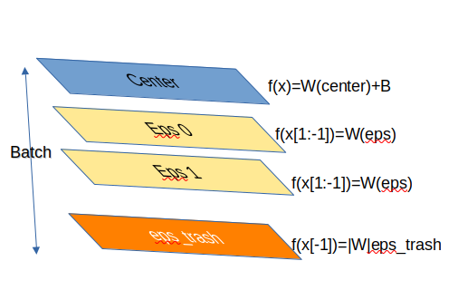

### AbstractTorch 🦸

Ceci est un prototype de moteur d'évaluation s'appuyant sur Torch 😎

L'idée originale consiste à utiliser la notion bien connue de batch pour faire l'évaluation d'un modèle. Cette astuce permet d'obtenir des résultats rapides ne nécessitant pas de refaire un modèle complexe. 
Par ailleurs, un autre avantage réside dans le fait que ce moteur d'évaluation permet de réaliser les calculs indisctinctement sur CPU ou sur GPU. 

On surcharge nn.Linear avec des méthodes hybrides, gérant un flux abstrait pour l'évaluation et un flux concret. La simultanéité des deux flux permet d'oberver la position du centre du zonotope par rapport à la valeur réelle de la sortie de la fonction. 

L'implémentation du modèle abstrait comporte une quantité fixe de symboles qui sont gérés comme des épaisseurs de batch. La dernière épaisseur de batch correspond au symbole poubelle, les opération linéaires sont opérées pour cette épaisseur par la valeur absolu de la matrice des poids. 

L'option add_symbol permet de générer de nouveaux symboles/ 
L'inférence peut se faire soit sur cpu (device=torch.device('cpu')) ou carte graphique (device = torch.device('cuda'ou 'mps'))

Pour l'instant sont implémentées les classes conv2D, Linear , maxpool2D(noyau 2) et ReLU.
        
# New feature :

 	🥳🥳🥳 avgpool est implémentée 	🥳🥳🥳     

On tire profit de la structure de base
de la méthode forward. Au lieu de considérer un batch, on considère une entrée en dimension 0 avec dans les dimensions habituelles du batch des couches de symbole. Une couche (un épaisseur de batch) représente
un symbole abstrait. La dernière couche correspond au symbole poubelle. 

La couche 0 représente le centre du zonotope
Les couches suivantes représentent les symboles. Elles sont calculées pour les opération linéaires (Linear et Conv2D) par 
$$\textbf{W}(x_\epsilon)$$
    x[1:]=lin(x_epsilon)-lin(torch.zeros_like(x_epsilon))

La derniere couche est toujours celle du bruit poubelle. Sur cette couche uniquement, les opérations linéaires  sont  calculées de la façon suivantes: 

$$\textbf{|W|}(x_{\epsilon_{noise}})$$

Pour implémenter le tenseur linéaire représentant la valeur absolue, on duplique la couche lin ou conv et on applique la valeur absolue à la matrice de poids. 

Cette dernière couche peut être nulle si les symboles générés sont projetés sur une nouvelle dimension. 

## Implémentation
Une classe abstractModule permet de réaliser les différentes opérations abstraites. 
Chacune des méthodes doit prendre en argument (centre,valeur_min,valeur_max,valeur vraie) et retourner (centre,valeur_min,valeur_max,valeur vraie). Si les arguments x_min et x_max n'ont aucune importance pour les couches linéaire, cette standardisation facilite l'écriture d'une méthode abstract_forward.

Une classe abstractWeight permet de tester un domaine abstrait dont les formes affines sont issues des poids d'une couche fully connected. 
 
## Empreinte mémoire 🧑‍🦽‍➡️
AbstractTorch est gourmand, très gourmand:
Un tenseur torch de dimension $N * C * H * W$ en float 32 possède une empreinte mémoire de  $N * C * H * W *4 *10^{-9}$ GB
Un domaine abstrait basée sur une image de taille 3 * 224 * 224 génère une empreinte d'environ 90 GB. 
si l'on applique une couche de convolution de noyau 64 , on aura un tenseur de 2 TO. Le code essaie d'éviter les copies intégrales du tenseur abstrait en cours d'évaluation, la mise à jours des variables est faite récurssivement dans les classes ReLU (x[index]=k*x[index]).

🏃La bonne nouvelle c'est qu'on peut borner l'empreinte mémoire (caractéristique à venir, 👷... )

